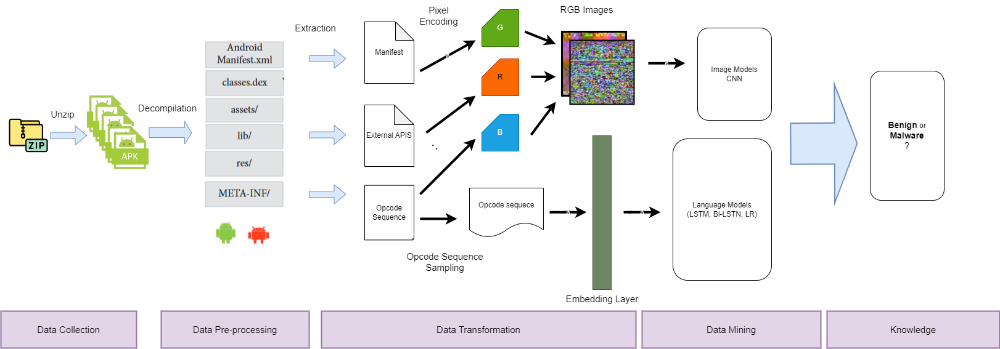
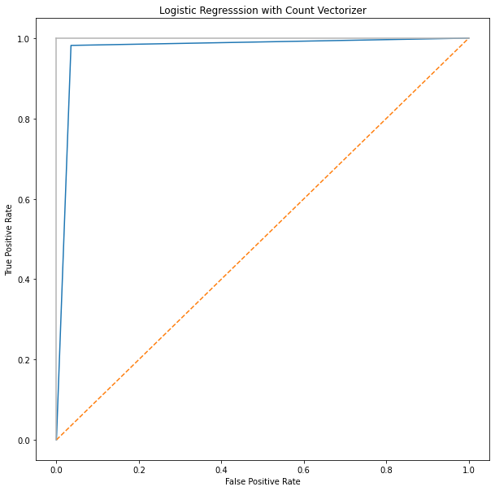
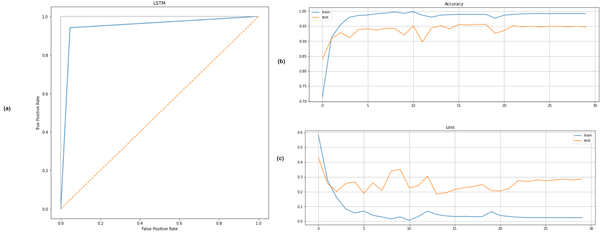
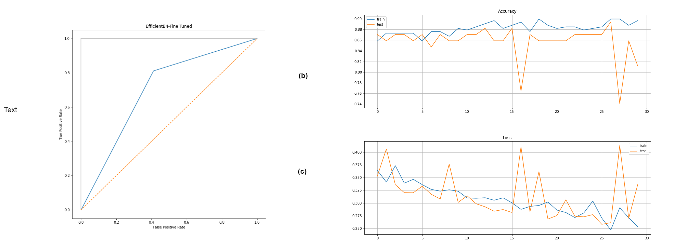

# Android Malware Detection using Text and Image Based Deep Learning Techniques

## Goal
The goal of the project was to examine image and text-based malware detection
strategies and proposing novel classification techniques. This project mainly focused on feature engineering techniques for
proper classification of android malwares with the data obtained from either Dex or
manifest files, or both. 

## Overview
This section gives a broad overview of the entire project . The key topics covered are, the details of
the chosen dataset, methodology. the classifiers used, the state of the art techniques employed , novelty achieved as a result of experiments ,classifier outcomes and the important metrics of evaluation.

### Dataset
The dataset *(Taheri et al. (2019))* selected for this research was collected from the official
website of *Canadian Institute of Cybersecurity at UNB (University of New Brunswick*).
It includes 1596 Apk files with the most current samples belonging from the year 2020.
The 6 samples are divided into six malware categories, with each category are then further
divided into their respective malware families. The primary categories, which comprises
up to 496 Apk files, are *Riskware, Adware, Banking Malware, SMS Malware, and Banking
Malware*. The remaining 1100 Apk files are the benign samples that were gathered from
the years 2015, 2016, and 2017.

### Methodology
The six step methodology also called *Knowledge Discovery in Databases **(KDD)*** was used in this project as depicted in **Figure 1** below:

                              Fig. 1: Methodology

### Classifiers Used for Malware Detection
Two strategies were used for classifying malwares in the project and the classifiers used from each of them are listed below:
+ **Text Based Approach**
	+ *Logistic Regression*
	+ *LSTM*
	+ *Bi-LSTM*
+ **Image Based Approach**
	+ *CNN*
	+ *EfficientNetB4*

### State of the art used
Several state of the art techniques were used in the project and these are as follows:
+ In the Image Based Approach to Android Malware Detection a state-of-the-art CNN 
model namely **EfficientNetB4** was used to transfer learn the malicious and benign 
app images along with their classification.
+ In the text-based approach state-of-the-art **Word2Vec** embedding algorithm was used 
to generate embedding space for the opcodes in the opcode sequences.
+ For both the approaches a novel bandit based tuning algorithm namely **HyperBand**
(Li et al., 2017)tuning was used to tune the hyperparameters of all the deep learning
models

### Novelty in the Project
According to the extent of the literature review conducted for the project ,following novelties can be identified to the best of the author's knowledge:

1. ***Feature Engineering in Text Based Approach:***
	+ In text-based approach contrary to the practice of using individual opcodes as 
tokens for input sequences, this project used collection of these opcodes 
*(aggregated based on the API definitions)* as tokens. As a result, more 
information was embedded in each token.
	+ In past research into Android Malware Detection using language models like 
LSTM, the sequence length of the input was always restricted to first 200 -
500 tokens per sequence. In the project a clever methodology was devised to extract 
sequences of similar length meant to represent the complete input using 
combination of operations like *splitting*, *shuffling* and *random sampling*.

2. ***Feature Engineering in Image Based Approach:***
	+ In this approach three different sources of information (manifest
file, external API calls and opcode sequences)was used to represent each of the colour
channels. Most research used only combination of opcode sequences and 
manifest for image generation, but here external API calls were also included as a 
separate colour channel to generate the images.

3.	***Hyper-parameter tuning of the implemented models:***
	+ State-of-the-art bandit based Hyper-parameter tuning algorithm 
namely HyperBand algorithm, first proposed in the paper (Li et al., 2017) was used for tuning 
all the advanced deep learning algorithms employed in the project.

### Classifier Outcomes
The models implemented in the project classifies whether an android application sample
is either **malicious** or **not**, which makes it a **binary classification** problem. Malicious applications
are labelled as ***”1”*** and belongs to the ***“Positive”*** class whereas the benign applications
are labelled as ***”0”*** and belongs to the ***“Negative”*** class. As a result, any benign
application predicted as *”1”* can be referred as **“False Positives”** and any malicious
applications predicted as *”0”* as **“False Negatives”**. Similarly, the opposite outcomes
are respectively **”True Negatives”** and **”True Positives”**.

### Evaluation
The proposed methodologies and models were evaluated in this step. Several experiments
were carried out and their results compared based on **accuracy, precision, recall, F1 scores**
and their **Inference times**. Apart from that, the models from both text and image-based
approaches were compared as well. Line graphs were generated using the validation
accuracy and losses against the epochs for the each one of the implemented neural network
models to track the training progress. AUC/ROC curves for each of the models were also
generated to better understand their performances. More details are provided in the section [Classifier Evaluation](#classifier-evaluation).

## Preparing Input Data for the Classifiers
Pre-processing of data for the text and image based classifiers from the collected apk files was one of the project's most crucial tasks; the specific strategies adopted are covered below.
1. ***Text Based Approach :***
Using **“AndroGuard”** opcode names from the application dex files were extracted dynamically and stored in their respective text file. Next using the novel **Opcode Sequence Sampling** 
technique described in the section [App Characterization for Text based Analysis](#app-characterization-for-text-based-analysis), the original sequences were reduced
to smaller ones. A corpus was then generated with all the transformed opcode sequences
and vocabulary extracted for training the word embedding models. **CountVectorizer**
from **Scikit learn** and **Word2Vec** from **Gensim** were then used to train the respective
embedding spaces. Simultaneously all the sequences were tokenized either manually or
automatically using **Keras Tokenizer**. To unify the length of the sequences across all
the applications necessary padding and masking were added. Finally, these uniform sequences were passed through the embedding layer to generate respective word embeddings
suitable to feed onto the next layer of DL models. In case of the Word2Vec embeddings
the weights were used to initialize the Keras Embedding Layer.

2. ***Image Based Approach :***
After the decompilation, the *opcodes*, *external api calls* and *manifest* information were
dynamically retrieved using **“AndroGuard”** and stored in their respective python lists.
During the next step. these lists were converted into a list of respective pixels values
using the technique mentioned in the section [App Characterization for Image based Analysis](#app-characterization-for-image-based-analysis). These lists were then transformed into
their respective 2D matrixes and then subjected to interpolation before getting merged
into one single image file. Both the tasks of interpolation and merging was handled by a
specialized library called **OpenCV**. The image files were then converted to **3D Numpy array**
and stored as **.npy** file prior to feeding them to the image classification models.
	
## Feature Engineering

### *App Characterization for Text based Analysis:*
Dalvik Bytecode/Opcode sequences from “classes.dex” files were chosen to represent an application for this task. Ideally, the cumulative number of all opcodes extracted
from the Dex files of an application may range somewhere between 1k to 200k. If each
opcode is 8 considered as a single token, the number is too large to be max sequence
length for sentiment analysis models like, LSTM. Moreover, plain splitting of the large
sequences into multiple sequence may introduce abnormal behaviour into the language
models. Under these circumstances, an intelligent technique was adopted to generate sequences of length between 100 – 500 tokens without losing much information. This novel
technique was named as Opcode Sequence Sampling. The step-by-step description
of the strategy is provided below along with its illustration in the **Figure 2**.

                                                          
	                   Fig 2. : Opcode Sequence Sampling
+ **Step 1 : Grouping -**
In the Dex files the opcodes are organized as classes and
methods. A class contains a State and a Behaviour. A State is represented by
variables, fields and constants, whereas the behaviour by its methods/api. These
apis are basically, blocks of basic instructions or opcodes as defined in the android
official3 website. In this step these opcodes were grouped together based on their
parent api and a list were generated. Essentially, the process converted each api
into a token.
+ **Step 2 : Filtering -**
In this step duplicate methods were removed from the list to
reduce redundancy.
+ **Step 3 : Splitting and Shuffling -**
The filtered method list was then split into
four equal parts and a new list was formed with each splitted list as its entries.
After each split operation the list of lists is shuffled.
+ **Step 4 : Sampling -**
 In this step random samples are retrieved from the split
lists and concatenated to form a single sequence. This is illustrated in the figure 2
above.

### *App Characterization for Image based Analysis:*
The basic idea was to generate RGB images using characteristic features of the application.
The process adopted to generate these images is depicted in **Figure 3**. There are two
parts to this process as described below.

                         Fig. 3 : Apk to Image Conversion

+ The first one revolves around the strategy behind transforming string values to the
corresponding colour pixels. This was done by encoding them into ASCII values
and taking their sum. Then modulus operation determined the corresponding pixel
for the string.

+ The second part employed the colour encoding strategy for generating pixel values
for red, green and blue channels using the application information. These generated colour channels were then merged using an image processing library to form
the final image. Also, during merging, an interpolation algorithm called **“Nearest Neighbour Interpolation”** 
are applied on the channels to unify the dimensions
of all the channels. Some examples of the generated image files are provided below
in the **Figure 4**. In a novel technique adopted in this research each of the colour
channels encoded one distinct feature of the application. The Red channel was used
to encode all the external API calls that doesn’t appear in the opcodes. The Blue
channel comprised only opcodes. The green channel captured all the important
information available and accessible from the manifest file. This information constitutes all the permissions, intents, libraries, features, and meta data of the android
components. This channel also encoded all the string values from the application.
The final image was then stored in an array prior to feeding them to the image
classification models.

     
	
	 
	                       Fig. 4 : Generated Images 
	
## Deep Learning Model implementation and thier Hyper-parameter Tuning 
Three language-based models were used for malware classifications, and those are Logistic Regression, LSTM and Bidirectional-LSTM. The tokenization and text embeddings for these models were obtained using CountVectorizer, Tokenizer and Word2Vec.
For Image based classification one state-of-the-art pre-trained model was chosen among
several based on its parameter size, accuracy and its suitability for running on handheld devices and that was EfficientNetB4. A detailed comparison of the most popular
Pre-Trained Image models, suitable for running on handheld devices are provided in
the **Table 1** below. Also, a CNN model was designed for making a comparison to
the chosen pre-trained model. Finally, a novel bandit based hyper-parameter tuning
algorithm namely **”HyperBand”** proposed in the paper *Li et al. (2017)* was used for
tuning all the models.

## Classifier Evaluation

### Performance Comparison of ML & DL models used in both NLP & Image based experiments
All the models are compared on the basis of performance scores and inference time as
explained in the Sub-Sections [Scores Comparison](#A._Scores_Comparison) and [Inference Time Comparison](#B._Inference_Time_Comparison) below.

***A. Scores Comparison***

Among all the metrics the most important for performance measurement in this project is
*”Sensitivity”* or *”Recall”* of the models along with the *”AUC/ROC”* score. This is
due to the fact that it is very important that all the models correctly predict the maximum
True Positives out of all the actual positives while displaying improved capability for
correctly separating the classes. The models need not be very accurate when predicting
actual negatives.

Following observations are made by comparing the **”Sensitivity”**, **”AUC/ROC”**
and the generated plots for the models:

+ Out of all the models, the Logistic Regression model’s performance paired with the
CountVectorizer was the best as can be seen in the **Table 2**. The AUC/ROC curve
for the model is provided in the **Figure 5**.

***Fig. 5:  AUC/ROC curve for Logistic Regression + Count Vectorizer***

+ It is also clear from the table that the LSTM models without word2vec embeddings perform significantly better than the rest. The plots for the two best NLP
based neural network models are provided below in the **Figure 6** and **7** respectively.
The left plot in both the figures displays the AUC/ROC curve. The top and
the bottom plots on the right side of the figures show the learning accuracy
and the loss of the model during the training phase.

***Fig. 6:  LSTM : a) AUC/ROC Curve, b) Epoch vs Accuracy, c) Epoch vs Loss***

***Fig. 7:  Bi-LSTM : a) AUC/ROC Curve, b) Epoch vs Accuracy, c) Epoch vs Loss***

+ When compared to text-based models, the evaluation metrics show the image-based
models to perform poorly. EfficientNetB4 and the base CNN model both fell
short of outperforming the most elementary text models. **Figure 8** and **9** show the
plots for the Base CNN models obtained and EfficentNetB4, respectively.

***Fig. 8:  Base CNN : a) AUC/ROC Curve, b) Epoch vs Accuracy, c) Epoch vs Loss***

***Fig. 9:  EfficientNetB4 : a) AUC/ROC Curve, b) Epoch vs Accuracy, c) Epoch vs Loss***

***B. Inference Time Comparison***

Inference time in deep learning refers to the total time required for a model to perform
one full forward propagation, which results in the production of an output given there
is an input. It is a crucial metric for deep learning model optimization.
This inference time can be deduced using two important metrics viz

+ ***FLOPs :*** It refers to the total number of Floating-Point Operations performed
by a model during one forward pass.This can be estimated by adding up the occurence of all the floating-point arithmetic operations like addition, subtraction,
multiplication, and division in the target deep learning model.

+ ***FLOPS :*** It refers to the total number of Floating-Point Operations a piece
of hardware can perform in a second.This can be estimated using data such as
CPU speed, core count, CPU instruction rate, and number of CPUs per node as
explained below:

`
FLOPS = R * S * T * U
`

Where,
+ ***R** = CPU speed in GHz*,
+ ***S** = Number of CPU cores*,
+ ***T** = CPU Instructions Per Cycle*,
+ ***U** = Number of CPUs per node*

*Finally Inference Time can be calculated as:*

`Inference Time = FLOPs/FLOPS`

Using the PIP package namely **“keras-flops”**, the FLOPs for all the deep learning
models were calculated, which is displayed in the **Table 3** below.

From the above table following observations can be made:

+ The NLP-based methods are the quickest of all the stated solutions. Based on
the Inference Time the fastest language model is the fine-tuned Bi-LSTM Model
using Word2Vec Embeddings with ***1.08e-05 G FLOPs***.
+ Second Fastest solution would be fined tuned LSTM model using Word2Vec
embeddings with ***1.933e-05 G FLOPs***.
+ The fastest solution in the image-based approach is the Base CNN model with
***0.251 G FLOPs*** whereas the second fastest is the fine-tuned Base CNN model
with ***0.504 G FLOPs***.

It can be clearly observed from the **Table 2** and **Table 3**, that Inference Time is
directly proportional to the accuracy of the deep learning models.

## Conclusion and Future Work
The metrics above show that the language-based models outperformed the image models
in terms of performance. It should be emphasized that the CNN models were trained
with additional data from manifest files and external APIs, but the language-based models
were trained exclusively on opcode data. Therefore, it is safe to say that the innovative
opcode sequence sampling technique used in this research to characterize the applications
performed very well. Additionally, it demonstrates how crucial, feature selection from the
decompiled APK files is to malware detection. By, generating more samples of the opcode
sequences, there is still room to enhance the performance of the language models.In the
future, further experiments can be conducted by concatenating together the best models
from both the approaches.

## References

Li, L., Jamieson, K., DeSalvo, G., Rostamizadeh, A. and Talwalkar, A. (2017). Hyperband: a novel bandit-based approach to hyperparameter optimization, The Journal of
Machine Learning Research 18(1): 6765–6816

Taheri, L., Kadir, A. F. A. and Lashkari, A. H. (2019). Extensible Android Malware
Detection and Family Classification Using Network-Flows and API-Calls, 2019 International Carnahan Conference on Security Technology (ICCST), pp. 1–8. ISSN:
2153-0742